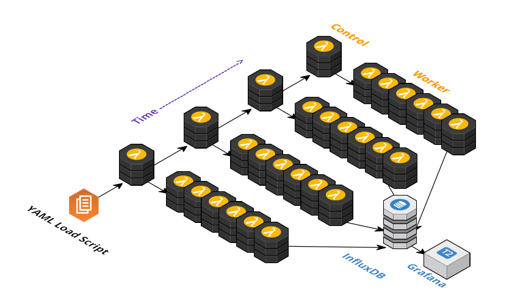

# Serverless-artillery using artillery.io and AWS Lambda: The Workshop

### TL;DR:
Seeeeeerverless-artillery is a Nordstrom open-source project. It builds on artillery.io and serverless.com by using the horizontal scalability and pay-as-you-go nature of AWS Lambda to instantly and inexpensively throw arbitrary load at your services and report results to an InfluxDB time-series database (other reporting plugins are available). This capability gives you performance and load testing on every commit, early in your CICD pipeline, so performance bugs can be caught and fixed immediately.

##### !!! Important Safety Notes !!!
* Serverless-artillery requires an AWS account and can run **hundreds or thousands** of AWS Lambda functions.  If you are already running AWS Lambda in production, please be aware of and understand your Lambda concurrency limits before using serverless-artillery.  If unsure, use a different AWS account from your production systems.
* You can easily generate **massive numbers** of transactions per second.  Please use this power responsibly.  We have set some soft limits (5,000 transactions per second and 12 hours) to help with this.
* Bugs and odd edge cases can result in Lambdas calling Lambdas calling Lambdas - monitor your AWS Lambda invocations during and after each run.  Understand how to revoke Lambdas (slsart remove) to stop runaway Lambda trains.
* AWS generally likes to know if you're launching a significant load test. They will also warm stuff up for you, which reduces throttling errors early in the test, meaning you don't have to throw as much data away.

## Come and see serverless-artillery in action on October 26th!
At the Serverless Conference London, we are co-hosting a workshop on Wednesday with the Serverless Framework team.  First, the Serverless Framework team will walk developers through deploying a sample serverless architecture using the new Serverless Framework v1.0.  We (Nordstrom tech) will follow this up by testing the resulting RESTful endpoints with the serverless-artillery toolset.
* install and run serverless-artillery against a sample endpoint
* customize your load script and target your own service
* use cloudwatch to understand the impact of this load
* report all load and error results to InfluxDB (a time-series database) and view with Grafana dashboards
* take advantage of Lambda scalability to create very large loads

## Technologies used
* **Artillery.io** is a modern Node.js load-testing framework. It offers rich functionality, has a strong focus on developer happiness, and is open-source.
* **AWS Lambda** is a service offered by Amazon Web Services.  One way of thinking about it is 'functions as a service.'
* **Serverless Application Framework** is an open source project with lots of handy tools to manage serverless configurations, shared code, and deploy your work.
* **InfluxDB** is a time-series database optimized for fast, real-time queries of immutable time-series data.
* **Grafana** is a visualization dashboard solution for viewing time-series data and metrics.

## Why?
Performance and load testing can be awkward and expensive.  This is especially true when very high loads are required. Our goal has been to make performance and load testing super easy so that it can be done earlier in your CI/CD (Continuous Integration / Continous Deployment) pipeline/release process.  Doing so enables (even very high load) performance tests to be automatically and quickly run against every commit. This solution produces P50/90/99 results (example: What was the latency for the slowest 1% of client repsonses?) that can be used to accept or reject commits for deployment within two minutes (or less, if you like). It can also be easily extended to compare latency results against past deployments or even drive an A/B performance split test with a prior build, depending on your deployment options.

## What is Artillery.io?
**Artillery.io** is an existing open-source node package built by Hassy Veldstra of shoreditch-ops that takes in a developer-friendly JSON or YAML load script, generates load, and measures the resulting latency and return codes. It supports multiple phases, ramps, ramp and hold, step load, multi-step flows, multiple weighted scenarios, and test data either from a test script or programmatically received or generated at run time. While not as fully-featured as Apache JMeter we like it because it has a rich-enough set of functionality, is written in Node.js, and supports easily editable test scripts in a modern format.

## Why serverless Artillery.io?
*Go wide, not deep* is a winning strategy for creating load generators, but that is typically expensive or complicated to setup with plain EC2 instances. Lambda makes this approach much more simple and cost effective.

On a single EC2 instance, you can easily get ~300 RPS (Requests Per Second) of load from artillery.io, in fact you may be able to coax >1,000 RPS with a larger instance and some tweaking - but what about when you need 50,000+ RPS to test your system? Additionally, our results have shown that the more load you are asking the test machine to generate, the slower your measured results are - even if the service under test is still performing quickly. From this finding we conclude that an ideal system would contain many *relaxed* load generators all comfortably measuring latency and then reporting their results to a central time-series database. AWS Lambda, with its ability to nearly instantly run as many load generators as necessary (within your account’s concurrency limit) is a great fit for this use-case - you just invoke a single lambda with a single test script.

## Coordinating Lambda functions towards a greater cause.
Each lambda function can only generate a certain amount of load, and can only run for up to five minutes (five minutes is a built-in limitation of AWS Lambda). Given these limitations, it is often necessary to invoke more lambdas - both to scale horizontally as well as handing off the work to a new generation of lambdas before their run-time has expired.

In this diagram we see how serverless-artillery solves this problem by first running in a control mode and examining the submitted load config JSON/YAML script (this is identical to the original “servered” artillery.io script). If the load exceeds what a single lambda is configured to handle, then the load config is chopped up into workloads achievable by a single lambda and as many lambdas as necessary are invoked. Towards the end of the five-minute runtime the controller lambda invokes a new lambda with the remainder of the script.

## Timing is everything
In order to account for long cold-start times (the very first time a Lambda function is invoked it can take several seconds) and retries (on occasional invoke failure), each worker lambda is given an absolute time in the near future when it is to start generating load. This allows the worker lambdas to be completely spun up and ready to go when their start time begins. Similarly, the control lambda is invoked ahead of time to give it time to invoke more workers. To allow for load scenarios to complete and give a comfortable amount of time for cold starts, we’ve configured the defaults for the system to run for no more than 4 minutes and start-up lambdas 15 seconds ahead of time. These options are configurable.

## How much load can a single lambda produce?
By increasing the maximum acceptable load for a single lambda well beyond its abilities and doing a ramp from 1 to 500 RPS, we've seen that a 1024-powered lambda maxes out at about 200 RPS. Additionally, we've found that the measured latencies increase as the lambda is loaded with more work. For this reason we’ve set default load per lambda to 25 RPS. If accurate latencies are not important, and concurrencies are your limit, you can use a 1536-power lambda at around 250 RPS. Remember that lambda power adjusts CPU, I/O, and RAM - not just RAM.  If you can coax more load out of a single Lambda, please share you techniques with us!

## What does all of this cost?
AWS Lambda charges based on both the number of invocations and the duration of each function. Here is an example of some costs assuming continuous execution and using the default settings:

Load|$ per hour|$ per day
----|----------|---------
50 RPS|$0.06|$1.4
500 RPS|$0.60|$14
5000 RPS|$6|$140

## Writing to InfluxDB (CloudWatch if you must)
If you don’t want to host an InfluxDB server on an EC2 instance, you can use our Cloud Watch plugin (artillery-plugin-cloudwatch). The main challenge we had with Cloud Watch metrics are that they compress the load data heavily, showing you only min/max/average once per minute. This is often acceptable; however, when debugging, it is much nicer to have the per-second resolution and arbitrary calculation capabilities of InfluxDB.  For this we created another plugin (artillery-plugin-influxdb).  We chose InfluxDB over DynamoDB because of its easy queries for percentile results, its speed, and its efficiency.  If you're interested in writing a results plug-in for artillery.io that supports DynamoDB we'd love to try it! 

> It should be noted that out-of-the-box, artillery.io supports sending metrics to statsd.  By using a statsd collector such as Telegraf, you can send metrics to InfluxDB, Prometheus, Graphite, Librato, Datadog, or a number of other metrics platforms.

## Load-testing IAM authenticated endpoints
Artillery.io also supports request plugins. In order to test latency against authenticated AWS API Gateway endpoints, we also contributed an AWS Signature V4 Signing plugin (artillery-plugin-aws-sigv4). This plugin allows the lambda to use its assigned AWS IAM Role to sign requests.

## Kudos!
* Huge props and all credit for the serverless-artillery code is due to Erik Erikson and Greg Smith, our senior developers behind all of this code.
* Special thanks also to Hassy Veldstra and the good devs at shoreditch-ops, creators of artillery.io - well done!
* Clearly, special thanks are due to Austen Collins and the rest of the crew at Serverless, Inc. who gave us the Serverless Framework, sparked our imaginations, and saved us a lot of pain.  Being in production with serverless architecture and staying sane requires a deployment framework, our pick is the Serverless Framework.

## We humbly request your thoughts and feedback
All feedback is welcomed - so don't be shy!
